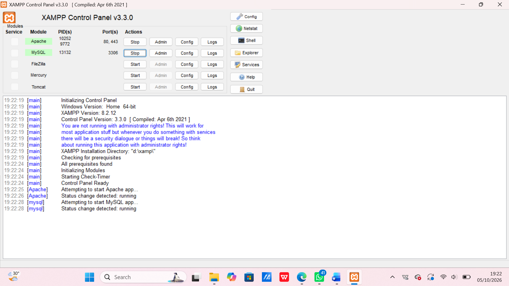
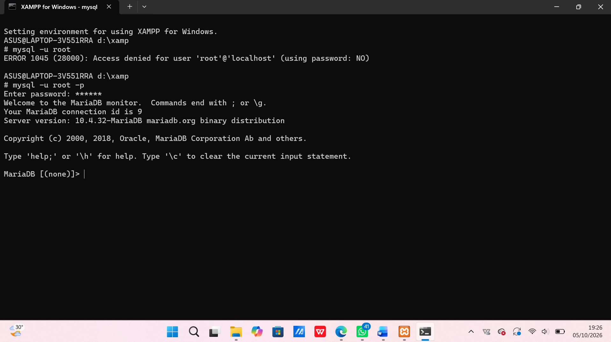
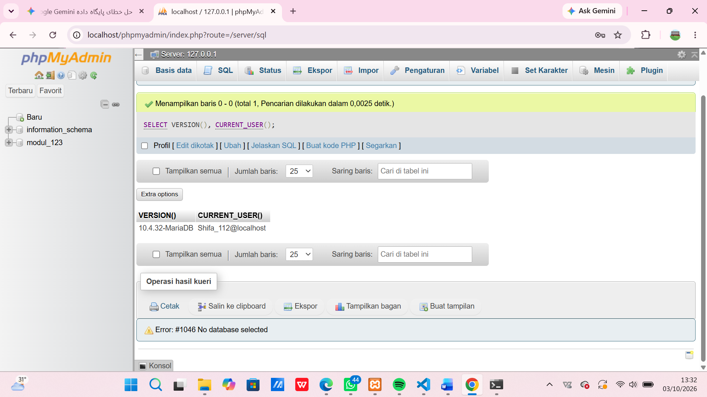
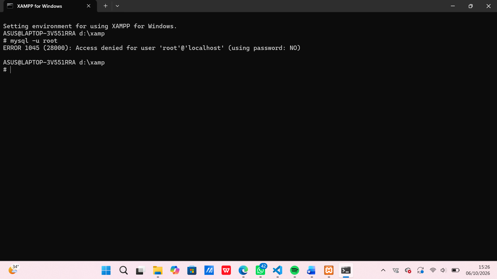
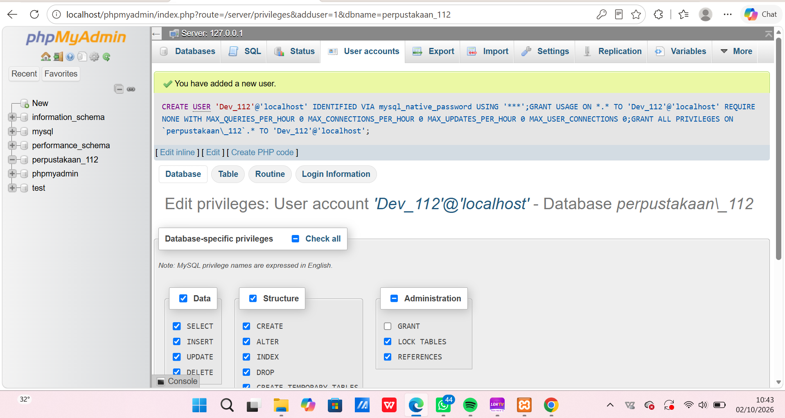

# LAPORAN PRAKTIKUM MATA KULIAH BASIS DATA

**Disusun Oleh:** Shifa Rahmanisa  
**NIM:** 25430112  
**Kelas:** D  

---

## 1.1 Tujuan
Kemarin saya mempelajari tahapan pengembangan sistem perpustakaan, yang mencakup konfigurasi serta pemantauan server MariaDB via XAMPP, pengelolaan database melalui phpMyAdmin, pengamanan akun root serta pembuatan akun operasional khusus, dan diakhiri dengan inisialisasi serta publikasi repositori Git pertama ke GitHub.

---

## 1.2 Ringkasan Teori
Basis data merupakan kumpulan data terstruktur yang dikelola melalui DBMS untuk mendukung akses multi-aplikasi secara aman. MariaDB beroperasi dengan arsitektur klien-server, di mana proses server (`mysqld`) pada port `3306` bertugas mengeksekusi perintah SQL dari klien. 

Penggunaan XAMPP dipilih untuk kepraktisan karena mengintegrasikan Apache, MariaDB, PHP, dan phpMyAdmin dalam satu instalasi. Penggunaan antarmuka baris perintah (CLI) lebih diutamakan daripada phpMyAdmin karena kemampuannya dalam menyusun skrip yang terstruktur dan dapat diulang. 

Selain itu, keamanan sistem dijaga melalui prinsip *least privilege*, yang memisahkan hak akses administratif akun root dari akun operasional harian. Sebagai pengendali versi, Git digunakan untuk mendokumentasikan riwayat pengembangan secara berkala melalui *commit* mingguan.

---

## 1.3 Langkah Percobaan

1. **Prosedur Menjalankan MariaDB:**  
   Aktifkan modul MySQL melalui XAMPP Control Panel hingga latar belakang berubah hijau, lalu pastikan kolom port menunjukkan angka `3306` dengan status aktif (*running*). 



2. **Command Line Interface (CLI):**  
   Akses layanan melalui XAMPP Shell menggunakan perintah 
   ```sql
   mysql -u root -p
   ```
    verifikasi versi serta pengguna aktif via 
   ```sql
   SELECT VERSION(), CURRENT_USER();
   ```
   serta lakukan pemeriksaan terhadap parameter 
   ```sql
   `sql_mode`.



3. **Mengamankan Akun Root:**  
   Menetapkan kata sandi untuk akun root pada host 
   ```sql
   `localhost` 
   ```
   menggunakan perintah `ALTER USER`.
   

  
4. **Inisialisasi Basis Data dan Konfigurasi Akses:**  
   Melakukan pembuatan basis data 
   ```sql
   `kopma_123` 
   ```
   menggunakan set karakter `utf8mb4` serta pembentukan akun `mhs_123` dengan hak akses eksklusif via `GRANT`. Selain itu, metode autentikasi phpMyAdmin dikonfigurasi menggunakan `cookie` pada berkas 
  ```sql
   `config.inc.php` 
   ```
   agar sistem mewajibkan proses masuk (*login*).
   

5. **Inisialisasi Repositori:**  
   Mempersiapkan file 
   ```sql
   `README.md`
   ``` 
   dan skrip SQL, dilanjutkan dengan mengaktifkan
    ```sql
    `git init`
    ```
     membuat komit perdana menggunakan konvensi standar, serta mengunggah (*push*) kode ke GitHub.

### Titik Analisis

* **Titik Analisis 1 (Catatan Penggunaan):**  
  Meskipun tombol kontrol XAMPP menampilkan label "MySQL", sistem basis data yang sebenarnya berjalan adalah MariaDB. Oleh karena itu, saat menghadapi kendala atau pesan galat (*error*), pastikan untuk merujuk pada dokumentasi resmi MariaDB agar solusi yang diterapkan akurat.

* **Titik Analisis 2 (Analisis Kendala):**  
  Akses akun root tanpa menyertakan opsi `-p` setelah kata sandi diatur akan memicu `ERROR 1045` dengan keterangan `(using password: NO)`. Pesan ini mengindikasikan bahwa klien sama sekali tidak mengirimkan kata sandi ke server basis data.
  

* **Titik Analisis 3 (Hak Akses Basis Data):**  
  Akun `mhs_123` tetap memiliki akses ke `information_schema` karena berfungsi sebagai basis data metadata internal sistem, namun akses ke basis data `mysql` ditolak dengan `ERROR 1044` akibat ketiadaan hak istimewa (*privileges*).  
  *Perbedaan utama:* Galat `1044` menunjukkan penolakan izin tingkat basis data, galat `1045` menandakan kegagalan autentikasi atau kesalahan kata sandi, dan galat `1142` merepresentasikan pembatasan perintah pada tingkat tabel.

* **Titik Analisis 4:**  
  Mode `cookie` jauh lebih aman dibanding `config` karena kita dipaksa input kata sandi secara manual setiap masuk, sehingga mencegah sembarang orang langsung masuk sebagai admin di komputer lab.

---

## 1.4 Latihan & Tugas Mandiri

### Latihan
* **Latihan 1:** Membuat akun `tamu_123` dengan hak akses `SELECT` saja. Pas dites menjalankan perintah `CREATE TABLE`, langsung ditolak server dengan pesan `ERROR 1142` karena perintah tersebut tidak diizinkan untuk peran tamu. *(Skrip dan tangkapan layar bukti berjalan terlampir)*
* **Latihan 2:** Memodifikasi skrip `p01_lingkungan_2301010123.sql` dengan menambahkan klausul `IF NOT EXISTS` pada perintah pembuatan database dan user, sehingga aman dijalankan berulang kali tanpa error bentrok. *(Skrip hasil latihan beserta bukti berjalan terlampir)*

### Tugas Mandiri: Milestone Proyek 1 (Tema Perpustakaan)
* Membuat basis data proyek perpustakaan `perpus_123` dengan pengodean karakter `utf8mb4`.
* Membuat akun khusus pengembang proyek `dev_112` yang hanya memiliki hak akses penuh ke basis data perpustakaan tersebut.
 
 Gambar .5 pembuatan akun DEV_112
* Menyusun file `README.md` dengan identitas proyek bertema perpustakaan (**Perpustakaan Cendekia SR**), mendeskripsikan lingkup layanan katalog dan peminjaman buku, serta membuat file `.gitignore` untuk melindungi berkas kredensial dari risiko terunggah ke GitHub.

---

## Pembahasan dan Kendala
* **Port 3306 Terpakai:** Diatasi dengan melacak PID lewat perintah `netstat` di Command Prompt lalu mematikan layanan yang menempati port tersebut atau menyesuaikan nomor port pada file konfigurasi `my.ini`.
* **Galat phpMyAdmin #1045:** Diatasi dengan mengubah tipe autentikasi dari `config` ke `cookie` pada file konfigurasi phpMyAdmin.


---

## Kesimpulan
Praktikum ini memberikan pemahaman mendalam tentang penyiapan lingkungan basis data MariaDB melalui XAMPP. Saya belajar menerapkan prinsip keamanan dasar lewat pembatasan hak akses akun, mengamankan antarmuka phpMyAdmin, serta membiasakan diri mendokumentasikan skrip secara rapi menggunakan Git dan GitHub untuk proyek sistem perpustakaan.

---

## Pernyataan Penggunaan AI
Asisten AI digunakan sebatas untuk membantu memahami arti pesan galat (*error message*) dari MariaDB dan referensi parameter konfigurasi. Seluruh langkah praktikum dan penulisan laporan dikerjakan secara mandiri.

---

## Bukti Git & Lampiran
* **Tautan Repositori GitHub:
** https://github.com/syifarahmanisa8-byte/basisdata_25430112.git
* **Kode Hash Commit:** `3f9c2ab` *(Pesan: p01: inisialisasi repositori dan skrip lingkungan)*

### Checklist Penilaian
- [x] **Identitas:** Nama, NIM, kelas, pertemuan ke-1, tanggal pelaksanaan, nama asisten/dosen
- [x] **Tujuan:** Tujuan praktikum ditulis ulang dengan bahasa sendiri (maksimal 5 baris)
- [x] **Ringkasan Teori:** Pemahaman sendiri atas Dasar Teori, maksimal setengah halaman, tanpa menyalin buku
- [x] **Langkah Percobaan (D):** Tangkapan layar hasil langkah kunci sesuai checklist khusus, masing-masing diberi keterangan singkat
- [x] **Titik Analisis:** Semua Titik Analisis dijawab lengkap dengan alasan, bukan sekadar ya/tidak
- [x] **Latihan (E):** Skrip/dokumen hasil latihan beserta bukti berjalan
