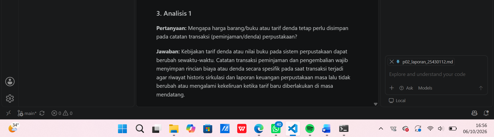
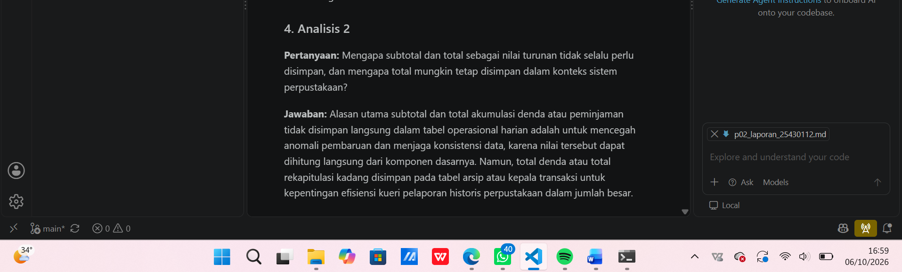
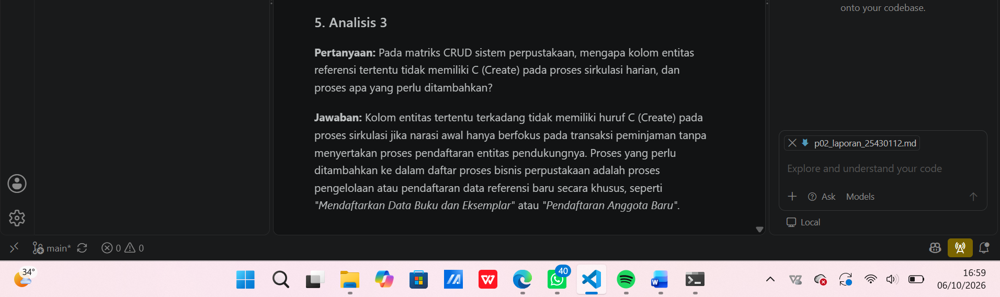
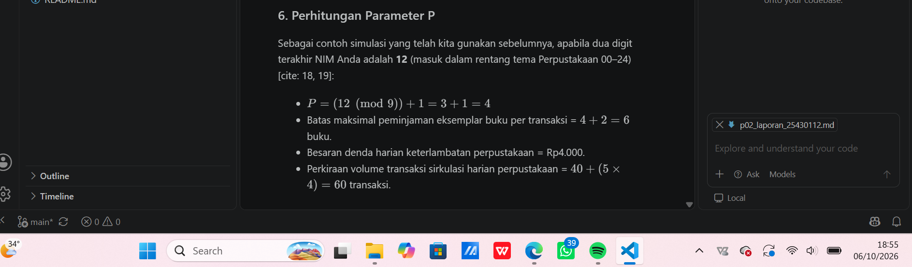
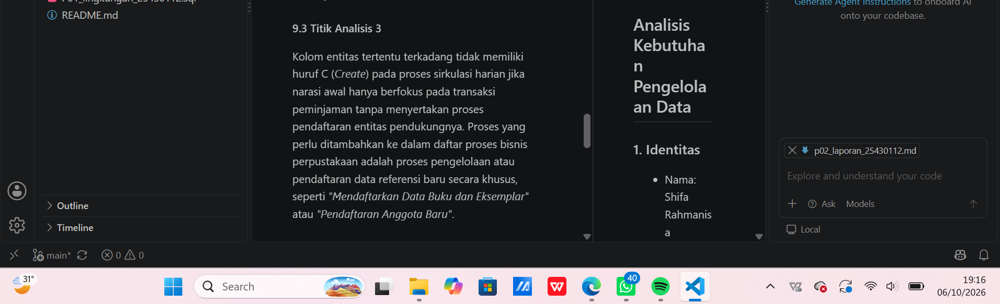
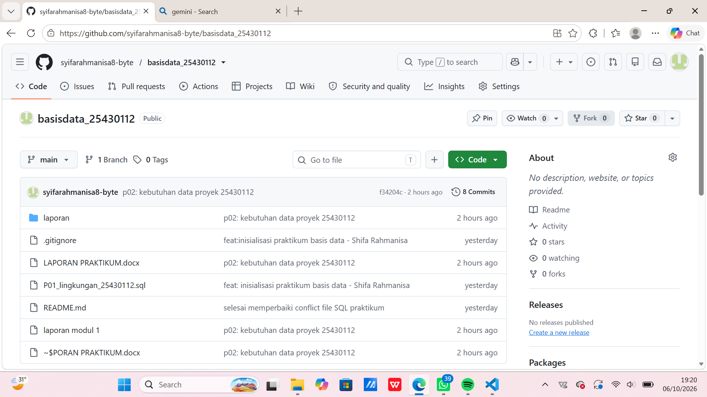
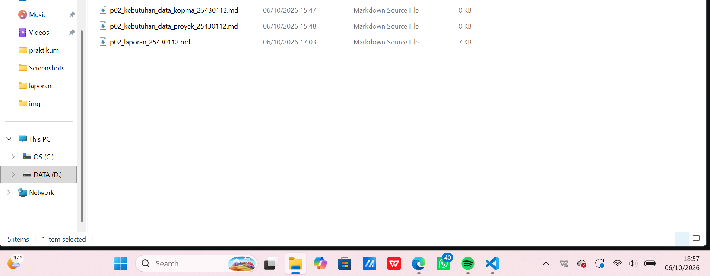

# Laporan Praktikum Pertemuan 2
## Analisis Kebutuhan Pengelolaan Data

### 1. Identitas
- Nama: Shifa Rahmanisa
- NIM: 25430112
- Kelas: D
- Pertemuan: 2
- Tema Proyek: Perpus_112
- Nama Organisasi: Perpustakaan Cendekia SR

### 2. Tujuan
Melalui kegiatan praktikum ini, mahasiswa dilatih untuk mengenali rangkaian aktivitas organisasi perpustakaan, mengenali pihak-pihak yang terlibat (aktor), serta memetakan alur proses bisnis sirkulasi bahan pustaka secara menyeluruh berdasarkan studi kasus, wawancara, dan dokumen sumber perpustakaan yang dikaji    .

### 3. Analisis 1
**Pertanyaan:** Mengapa harga barang/buku atau tarif denda tetap perlu disimpan pada catatan transaksi (peminjaman/denda) perpustakaan?

**Jawaban:**
Kebijakan tarif denda atau nilai buku pada sistem perpustakaan dapat berubah sewaktu-waktu. Catatan transaksi peminjaman dan pengembalian wajib menyimpan rincian biaya atau denda secara spesifik pada saat transaksi terjadi agar riwayat historis sirkulasi dan laporan keuangan perpustakaan masa lalu tidak berubah atau mengalami kekeliruan ketika tarif baru diberlakukan di masa mendatang.

### 4. Analisis 2
**Pertanyaan:** Mengapa subtotal dan total sebagai nilai turunan tidak selalu perlu disimpan, dan mengapa total mungkin tetap disimpan dalam konteks sistem perpustakaan?

**Jawaban:**
Alasan utama subtotal dan total akumulasi denda atau peminjaman tidak disimpan langsung dalam tabel operasional harian adalah untuk mencegah anomali pembaruan dan menjaga konsistensi data, karena nilai tersebut dapat dihitung langsung dari komponen dasarnya. Namun, total denda atau total rekapitulasi kadang disimpan pada tabel arsip atau kepala transaksi untuk kepentingan efisiensi kueri pelaporan historis perpustakaan dalam jumlah besar.

### 5. Analisis 3
**Pertanyaan:** Pada matriks CRUD sistem perpustakaan, mengapa kolom entitas referensi tertentu tidak memiliki C (Create) pada proses sirkulasi harian, dan proses apa yang perlu ditambahkan?

**Jawaban:**
Kolom entitas tertentu terkadang tidak memiliki huruf C (Create) pada proses sirkulasi jika narasi awal hanya berfokus pada transaksi peminjaman tanpa menyertakan proses pendaftaran entitas pendukungnya. Proses yang perlu ditambahkan ke dalam daftar proses bisnis perpustakaan adalah proses pengelolaan atau pendaftaran data referensi baru secara khusus, seperti *"Mendaftarkan Data Buku dan Eksemplar"* atau *"Pendaftaran Anggota Baru"*.

### 6. Perhitungan Parameter P

Sebagai contoh simulasi yang telah kita gunakan sebelumnya, apabila dua digit terakhir NIM Anda adalah **12** (masuk dalam rentang tema Perpustakaan 00–24)[cite: 18, 19]:

- $P = (12 \pmod 9) + 1 = 3 + 1 = 4$
- Batas maksimal peminjaman eksemplar buku per transaksi = $4 + 2 = 6$ buku.
- Besaran denda harian keterlambatan perpustakaan = Rp4.000.
- Perkiraan volume transaksi sirkulasi harian perpustakaan = $40 + (5 \times 4) = 60$ transaksi.

### 7. Hasil Dokumen Kebutuhan Data Proyek

Dokumen kebutuhan data proyek telah dibuat untuk organisasi Perpustakaan Cendekia SR dengan tema Perpustakaan.

Berkas:
`p02_kebutuhan_data_proyek_112.md`

Isi utama meliputi:
- Proses bisnis perpustakaan (pendaftaran anggota, pengelolaan katalog buku, peminjaman, pengembalian, laporan sirkulasi)
- Entitas kandidat perpustakaan (anggota, buku, eksemplar, peminjaman, pengembalian, petugas)
- Aturan bisnis perpustakaan (AB-01 sampai AB-05)
- Kebutuhan informasi perpustakaan (KI-01 sampai KI-04)
- Matriks CRUD
- Kamus data awal perpustakaan (dengan kolom penanggung jawab / *data steward*)
- Kebutuhan non-fungsional perpustakaan (volume, retensi, privasi data pribadi anggota)
- Isu kualitas data perpustakaan yang diantisipasi

### 8. Perbaikan Kebutuhan yang Kabur
a. Data anggota perpustakaan harus aman
**Perbaikan:**
Setiap pendaftaran anggota perpustakaan baru wajib merekam nomor anggota unik, NIM 10 digit, nama lengkap, program studi, nomor HP valid yang dikategorikan sebagai data pribadi, status aktif, dan tanggal pendaftaran secara lengkap.

#### b. Sistem perpustakaan harus cepat mencari buku
**Perbaikan:**
Sistem mampu menampilkan hasil penelusuran katalog buku perpustakaan berdasarkan judul, penulis, atau nomor ISBN dalam waktu kurang dari 1 detik dengan indeks berbasis kunci unik.

#### c. Laporan sirkulasi perpustakaan harus akurat
**Perbaikan:**
Laporan bulanan perpustakaan harus menampilkan rekapitulasi jumlah total peminjaman, jumlah pengembalian tepat waktu, total akumulasi denda keterlambatan, serta daftar 5 buku yang paling sering dipinjam per bulan.

#### a. Data anggota perpustakaan harus aman
Perbaikan:
Setiap pendaftaran anggota perpustakaan baru wajib merekam nomor anggota unik, NIM 10 digit, nama lengkap, program studi, nomor HP valid yang dikategorikan sebagai data pribadi, status aktif, dan tanggal pendaftaran secara lengkap.

#### b. Sistem perpustakaan harus cepat mencari buku
Perbaikan:
Sistem mampu menampilkan hasil penelusuran katalog buku perpustakaan berdasarkan judul, penulis, atau nomor ISBN dalam waktu kurang dari 1 detik dengan indeks berbasis kunci unik.

#### c. Laporan sirkulasi perpustakaan harus akurat
Perbaikan:
Laporan bulanan perpustakaan harus menampilkan rekapitulasi jumlah total peminjaman, jumlah pengembalian tepat waktu, total akumulasi denda keterlambatan, serta daftar 5 buku yang paling sering dipinjam per bulan.

### 9. Bukti Tangkapan Layar

Gambar 1 pengecekan analisis 1

Gambar 2 pengecekan analisis 2

Gambar 3 pengecekan analisis 3

#### 9.1 Titik Analisis 1
Harga buku atau tarif layanan dapat mengalami penyesuaian sewaktu-waktu akibat kebijakan pengelola perpustakaan. Oleh karena itu, rincian biaya atau denda wajib disimpan secara spesifik pada saat transaksi terjadi agar riwayat historis sirkulasi dan laporan rekapitulasi keuangan masa lalu tetap akurat dan tidak berubah ketika tarif baru diberlakukan di masa mendatang.
#### 9.2 Titik Analisis 2
Alasan utama subtotal dan total akumulasi denda atau peminjaman tidak disimpan secara langsung dalam tabel operasional harian adalah untuk mencegah anomali pembaruan dan menjaga konsistensi data, karena nilai tersebut dapat dihitung secara langsung dari komponen dasarnya[cite: 47]. Namun, total denda atau total rekapitulasi transaksi kadang tetap disimpan pada tabel arsip atau kepala transaksi untuk kepentingan efisiensi kueri pelaporan historis dalam jumlah besar[cite: 47].

#### 9.3 Titik Analisis 3
Kolom entitas tertentu terkadang tidak memiliki huruf C (*Create*) pada proses sirkulasi harian jika narasi awal hanya berfokus pada transaksi peminjaman tanpa menyertakan proses pendaftaran entitas pendukungnya. Proses yang perlu ditambahkan ke dalam daftar proses bisnis perpustakaan adalah proses pengelolaan atau pendaftaran data referensi baru secara khusus, seperti *"Mendaftarkan Data Buku dan Eksemplar"* atau *"Pendaftaran Anggota Baru"*.

#### 9.4 Perhitungan Parameter P

Gambar 7 perhitungan parameter

#### 9.5 Perbaikan Tiga Pernyataan Kebutuhan Kabur

titik analisis 3

perhitungan parameter

#### 9.6 Dokumen Kebutuhan Data Proyek di GitHub

Gambar 9 kebutuhan data proyek

### 10. Kesimpulan
Analisis kebutuhan data merupakan fondasi penting dalam perancangan basis data sistem Perpustakaan Cendekia SR agar terhindar dari anomali struktural[cite: 42, 43]. Melalui identifikasi aktor, proses bisnis sirkulasi, aturan bisnis, kamus data berpenanggung jawab (*data steward*)[cite: 43, 44], serta parameter personal berbasis NIM ($P = 4$), dokumen kebutuhan data proyek perpustakaan telah tersusun lengkap dan siap digunakan sebagai acuan pembuatan ERD perpustakaan pada Modul 3[cite: 42].